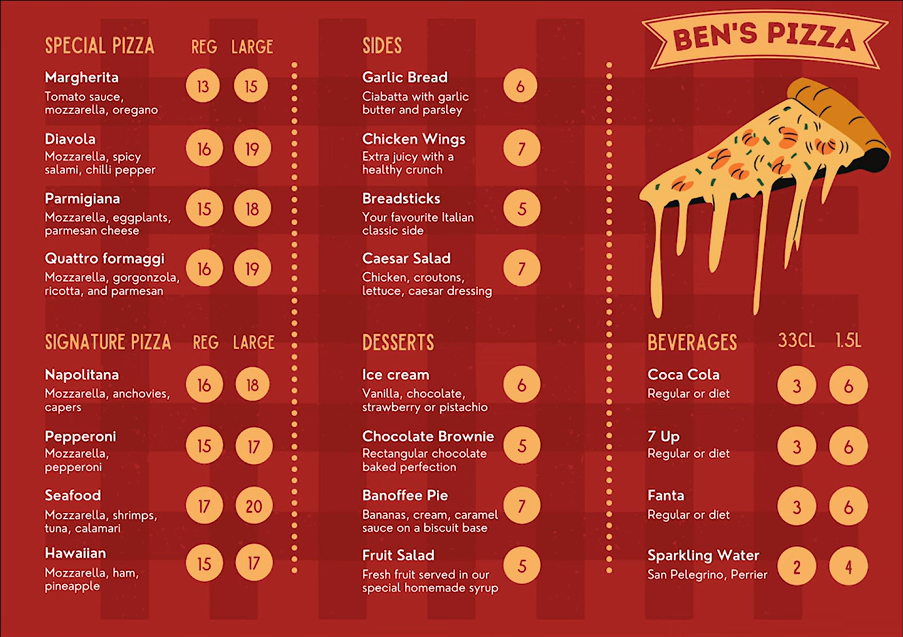
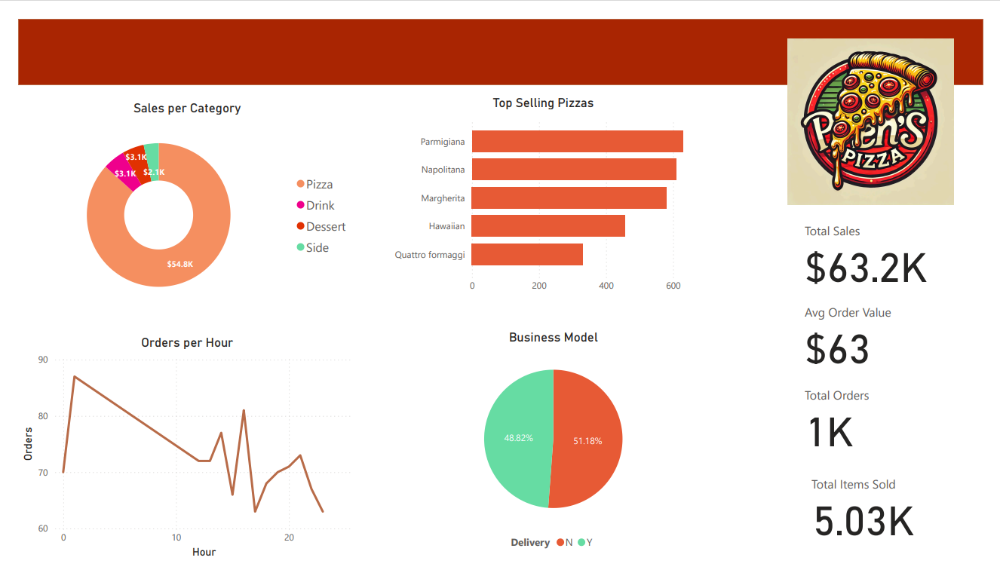

-- To be updated Later
# Introduction

Exploring the Restaurant management world with a real world scenario! This project deals with a client named Ben who owns a pizza Shop. As Analyst, my task was to provide insights on sales, revenues, best performing products, etc.  

🔍 Check out sql queries here: [project_folder](/SQL_files/)

# Background
Motivated to advance my expertise in SQL and PowerBI, this project arose from my interest in broadening my analytical skills and delving into sectors such as the fast food industry and overall sales. The data, compiled from various sources like Ben's Pizza shop Menu and ChatGPT, covers a wide array of details including orders, recipes, customers, ingredients, and more.



### The questions we need to answer:
This Project can be divided into 2 sub-projects: The first one deals Inventory, the second part with the business side. We will focus on the latter.

1. What are the total orders, total items sold, total sales, and the average order value ? 
2. What are the sales per category, and the top performing items?
3. What are the orders/sales per hour, and the sales model?

# Tools Used

- **SQL**: The first main tool of my analysis.
- **PostgreSQL**: The selected database management system.
- **PowerBI**: My second main means of analysis, and the tool used for visualization.
- **Visual Studio Code**: My go to IDE for all projects.
- **Git & GitHub**: for version control and sharing my analysis.

# Analysis

### 1. First Task
I started by identifying the total orders. Since the order_id column can have multiple occurences (multiple items ordered per client), we used DISTINCT to fetch the correct number of orders. Next I wanted to see the sales per order before calculating the total sales. Next, we answered the remaining questions. A Dashboard containing the results is attached, so I will not be showing sql query results here.

```sql
-- Total orders ?
SELECT COUNT(DISTINCT order_id) AS Total_Orders
FROM orders

--Total sales ? 

-- 1) Sales per order (Extra)
SELECT order_id, SUM(item_price * quantity) AS order_revenue
FROM orders as o
LEFT JOIN items as i
ON i.item_id = o.item_id
GROUP BY order_id
ORDER BY order_id

--2) Total sales
with sales_per_order AS (
    SELECT order_id, 
    SUM(item_price * quantity) AS order_revenue
    FROM orders as o
    LEFT JOIN items as i
    ON i.item_id = o.item_id
    GROUP BY order_id
    ORDER BY order_id
)

SELECT SUM(order_revenue) AS total_sales
FROM sales_per_order

-- Total items sold?
SELECT SUM(quantity) AS total_items_sold
FROM orders

-- Average Order Value? 
SELECT (SUM(item_price * quantity) / COUNT(DISTINCT order_id)) AS Average_Order_Value
FROM orders as o
LEFT JOIN items as i
ON i.item_id = o.item_id


```


### 2. Second Task

This query helped identify the sales per category, the top performing items , and The best selling Pizzas

```sql
-- Sales per Category?
SELECT item_cat, SUM(item_price * quantity) AS sales_per_category
FROM orders as o
LEFT JOIN items as i
ON i.item_id = o.item_id
GROUP BY item_cat


-- Top selling items?

SELECT o.item_id, sku, SUM(quantity) AS items_sold
FROM orders as o
LEFT JOIN items as i
ON i.item_id = o.item_id
GROUP BY o.item_id, sku
ORDER BY items_sold DESC

-- Top selling pizzas? 
SELECT item_name, SUM(quantity) AS pizzas_sold
FROM orders as o
LEFT JOIN items as i
ON i.item_id = o.item_id
GROUP BY item_name, item_cat
HAVING item_cat = 'Pizza'
ORDER BY pizzas_sold DESC


```

### 3. Final questions

Our final questions to be answered were the following

```sql
-- Orders per hour ?
With Time_order AS (
SELECT DISTINCT order_id, 
EXTRACT(Hours from created_at) as Order_Time
FROM orders
)
SELECT Order_Time, count(Order_Time) AS orders_per_hour
from Time_order
GROUP BY Order_Time
ORDER BY orders_per_hour DESC

--Sales per hour ?
With Time_order AS (
SELECT order_id, quantity, item_id,
EXTRACT(Hours from created_at) as Order_Time
FROM orders
)
SELECT Order_Time, SUM(quantity * item_price) AS sales_per_hour
from Time_order
LEFT JOIN items
ON items.item_id = Time_order.item_id
GROUP BY Order_Time
ORDER BY sales_per_hour DESC


--Orders by delivery/ pick up ? (Business model)
SELECT CASE
WHEN delivery = true then 'Delivery'
ELSE 'Pick_up'
END AS order_type,
COUNT(DISTINCT order_id) AS order_count
FROM orders
GROUP BY order_type
```


# Conclusion:
### The results of our Analysis are shown below



